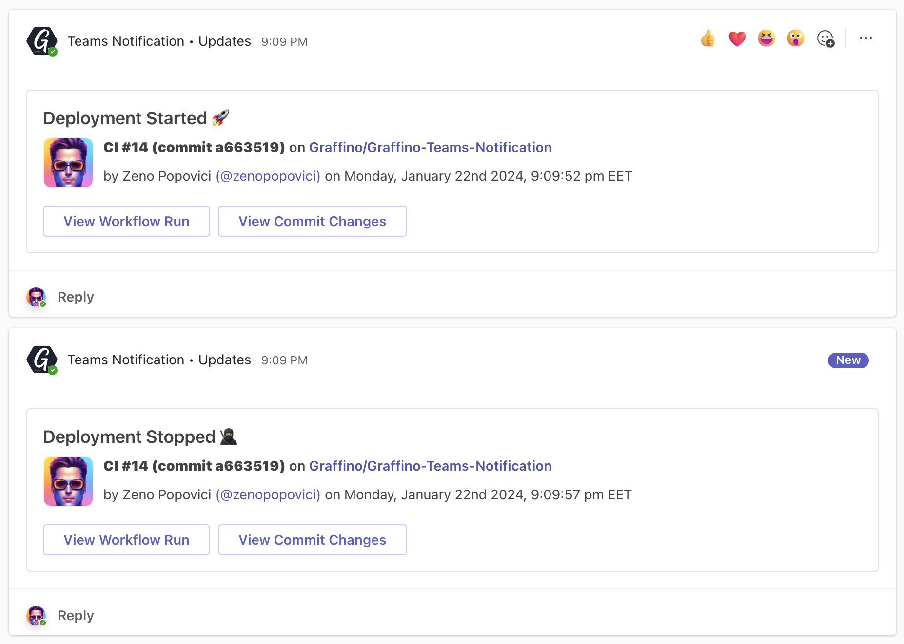

# Microsoft Teams Notification


A GitHub Action that sends customizable notifications to a dedicated Microsoft Teams channel.

## Usage

1. Add `MS_TEAMS_WEBHOOK_URI` on your repository's configs on Settings > Secrets. It is the [Webhook URI](https://docs.microsoft.com/en-us/microsoftteams/platform/webhooks-and-connectors/how-to/add-incoming-webhook) of the dedicated Microsoft Teams channel for notification.

2. Add a new `step` on your workflow code below `actions/checkout@v2`:

```yaml
name: Graffino Teams Notification

on: [push, pull_request]

jobs:
  build:
    runs-on: ubuntu-latest

    steps:
      - name: Workflow Start
        uses: Graffino/Graffino-Teams-Notification@v2
        with:
          github-token: ${{ github.token }} 
          ms-teams-webhook-uri: ${{ secrets.MS_TEAMS_WEBHOOK_URI }}
          notification-summary: "Your custom notification message including emoji. E.g 'Workflow start 🚀'"
          timezone: Europe/Bucharest

[...]
      - name: Workflow End
        uses: Graffino/Graffino-Teams-Notification@v2
        with:
          github-token: ${{ github.token }} 
          job: ${{ toJson(job) }}
          ms-teams-webhook-uri: ${{ secrets.MS_TEAMS_WEBHOOK_URI }}
          notification-summary: "Workflow end: ${{ job.status }}"          
          timezone: Europe/Bucharest
```

3. Make it your own with the following configurations.
   - `github-token` - (required), set to the following:
     - `${{ github.token }}`
   - `webhook-uri` - (required), setup a new secret to store your Microsoft Teams Webhook URI (ex. `MS_TEAMS_WEBHOOK_URI`). Learn more about setting up [GitHub Secrets](https://help.github.com/en/actions/configuring-and-managing-workflows/creating-and-storing-encrypted-secrets) or [Microsoft Teams Incoming Webhook](https://docs.microsoft.com/en-us/microsoftteams/platform/webhooks-and-connectors/how-to/add-incoming-webhook).
   - `notification-summary` (required), Your custom notification message (ex. Deployment Started or Build Successful)
   - `timezone` - (optional, defaults to `UTC`), a [valid database timezone name](https://en.wikipedia.org/wiki/List_of_tz_database_time_zones), (ex. Australia/Sydney or America/Denver, etc.)
   - `timeout` - (optional, defaults to 5s), this prevents action from getting stuck when Teams WebHooks misbehave.
   - `job` - Shoud contain the stringified object for the current job, used to get the job status and display notification accordingly. You can get it using `job: ${{ toJson(job) }}`

## Examples

Here's how it wil look:


